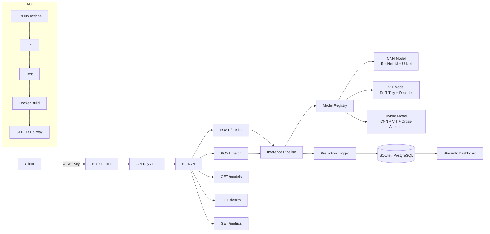

# MedSegAPI — Production Medical Image Segmentation Platform


A production-grade REST API serving three lung segmentation models (CNN, ViT, and
Hybrid CNN-ViT) for chest X-ray analysis. Built from a master's thesis that achieved
96.65% Dice coefficient on the Montgomery dataset, this project demonstrates the full
MLOps lifecycle: research model training, model registry, containerized API serving,
CI/CD pipelines, prediction logging, monitoring dashboards, API key authentication,
rate limiting, and continuous retraining.

## Architecture



## Quick Start

### Docker (recommended)

```bash
cp .env.example .env                    # configure environment
docker compose up --build -d            # start API + PostgreSQL
curl http://localhost:8000/api/v1/health # verify
```

### Local development

```bash
# Install dependencies
uv sync

# Set up model weights
python scripts/setup_models.py

# Generate an API key
python scripts/create_api_key.py --name "dev-local"

# Start the API server
uv run uvicorn src.api.main:app --reload
```

The API will be available at `http://localhost:8000`. Interactive docs at `/docs`.

## API Documentation

### Public endpoints (no auth required)

| Method | Endpoint | Description |
|--------|----------|-------------|
| GET | `/api/v1/health` | Liveness check |
| GET | `/api/v1/ready` | Readiness check (models loaded) |

### Protected endpoints (require `X-API-Key` header)

| Method | Endpoint | Description |
|--------|----------|-------------|
| POST | `/api/v1/predict` | Single image segmentation |
| POST | `/api/v1/batch` | Batch segmentation (up to 10 images) |
| GET | `/api/v1/models` | List available models |
| GET | `/api/v1/models/{name}` | Model details and metrics |
| GET | `/api/v1/metrics` | Aggregated prediction metrics |
| GET | `/api/v1/predictions` | Recent prediction history |

### Examples

**Generate an API key:**

```bash
python scripts/create_api_key.py --name "my-client"
# Save the printed key — it cannot be recovered
```

**Single prediction:**

```bash
curl -X POST http://localhost:8000/api/v1/predict \
  -H "X-API-Key: YOUR_KEY" \
  -F "file=@chest_xray.png"
```

**Batch prediction:**

```bash
curl -X POST http://localhost:8000/api/v1/batch \
  -H "X-API-Key: YOUR_KEY" \
  -F "files=@image1.png" \
  -F "files=@image2.png" \
  -F "files=@image3.png"
```

**Choose a specific model:**

```bash
curl -X POST "http://localhost:8000/api/v1/predict?model_name=cnn_only" \
  -H "X-API-Key: YOUR_KEY" \
  -F "file=@chest_xray.png"
```

**List models:**

```bash
curl http://localhost:8000/api/v1/models \
  -H "X-API-Key: YOUR_KEY"
```

**Check metrics:**

```bash
curl "http://localhost:8000/api/v1/metrics?hours=24" \
  -H "X-API-Key: YOUR_KEY"
```

### Rate Limits

- **10 requests/minute** and **100 requests/hour** per API key
- Returns `429 Too Many Requests` with a `Retry-After` header when exceeded
- `/health` and `/ready` are exempt from rate limiting

### Supported Formats

- **Images:** PNG, JPEG
- **Medical:** DICOM (`.dcm`, `.dicom`)
- **Input size:** 512x512 (auto-resized)

## Model Performance

All models accept 512x512 3-channel chest X-ray images and output binary lung
segmentation masks. Evaluated on the Montgomery County (MC) dataset:

| Model | Architecture | Dice | IoU | HD95 | Parameters |
|-------|-------------|------|-----|------|------------|
| **Hybrid** (default) | CNN + ViT + Cross-Attention Fusion | 96.65% | 93.60% | 4.2 | 4.2M |
| ViT-only | DeiT-Tiny + Progressive Decoder | 95.18% | 90.82% | 19.7 | ~8-10M |
| CNN-only | ResNet-18 Encoder + U-Net Decoder | 94.18% | 89.03% | 26.7 | ~15-18M |

**Cross-dataset generalization (Hybrid model):**

| Dataset | Images | Dice |
|---------|--------|------|
| Montgomery (MC) | 138 | 96.65% |
| JSRT | 247 | 95.18% |
| Shenzhen | 662 | 94.82% |

### Training Configuration (thesis defaults)

| Parameter | Value |
|-----------|-------|
| Learning rate | 0.0005 |
| Batch size | 32 |
| Image size | 512x512 |
| Loss function | Focal + Dice + Boundary |
| Optimizer | Adam |
| Scheduler | CosineAnnealingLR |
| Early stopping | Patience 10 |

## Training

### Train a model from scratch

```bash
python scripts/train.py --model hybrid --epochs 50
```

### Retrain with new data

```bash
# Add new data to the pipeline
python scripts/add_new_data.py --source /path/to/images --dataset montgomery

# Preprocess
python scripts/preprocess_data.py

# Retrain
python scripts/retrain.py --model hybrid --epochs 20
```

### Evaluate a model

```bash
python scripts/evaluate.py --model hybrid --dataset montgomery
```

### Register a trained model

```bash
python scripts/register_model.py --model hybrid --version v2 --path models/hybrid/best.pth
```

### Trigger retraining via CI

Use the `Retrain` workflow in GitHub Actions (workflow_dispatch) and select the model
variant to retrain.

## Monitoring

### Streamlit Dashboard

```bash
streamlit run monitoring/streamlit_app.py
```

The dashboard provides four tabs:

- **Overview** — total predictions, average latency, model distribution, throughput
- **Performance** — latency scatter plots, histograms, P50/P95/P99 percentiles
- **Quality** — confidence score distribution, lung coverage trends, symmetry ratio, low-confidence alerts
- **Model Registry** — registered models with Dice/IoU/HD95 comparison charts

Environment variables:
- `MEDSEG_DB` — path to predictions database (default: `predictions.db`)
- `MEDSEG_REGISTRY` — path to model registry YAML (default: `configs/model_registry.yaml`)

### API Metrics Endpoint

```bash
curl "http://localhost:8000/api/v1/metrics?hours=24" \
  -H "X-API-Key: YOUR_KEY"
```

Returns aggregated stats: total predictions, average/min/max latency, average
confidence, model distribution.

## CI/CD

The project uses GitHub Actions with three workflows:

### CI (`ci.yml`) — on push/PR to main

```
Lint (ruff check + format) → Test (pytest + coverage) → Build (Docker)
```

### CD (`cd.yml`) — on push to main

Builds and pushes the Docker image to GitHub Container Registry (`ghcr.io`).

### Retrain (`retrain.yml`) — manual trigger

Select a model variant (CNN, ViT, Hybrid) and trigger retraining via `workflow_dispatch`.

## Project Structure

```
medseg-api/
├── Dockerfile                     # Multi-stage production build
├── docker-compose.yml             # API + PostgreSQL stack
├── pyproject.toml                 # Dependencies (uv)
├── uv.lock
├── configs/
│   ├── model_registry.yaml        # Model versions and metrics
│   └── serving.yaml               # Server and model config
├── src/
│   ├── api/
│   │   ├── main.py                # FastAPI app factory and lifespan
│   │   ├── routes/
│   │   │   ├── predict.py         # POST /predict, /batch
│   │   │   ├── models.py          # GET /models
│   │   │   ├── health.py          # GET /health, /ready
│   │   │   └── monitoring.py      # GET /metrics, /predictions
│   │   ├── middleware/
│   │   │   ├── auth.py            # API key authentication
│   │   │   ├── rate_limit.py      # Per-key rate limiting
│   │   │   └── logging_mw.py      # Request logging
│   │   └── schemas/
│   │       ├── request.py         # Input validation models
│   │       └── response.py        # Response models + disclaimer
│   ├── models/
│   │   ├── architectures/
│   │   │   ├── cnn_model.py       # ResNet-18 + U-Net
│   │   │   ├── vit_model.py       # DeiT-Tiny + Decoder
│   │   │   └── hybrid_model.py    # CNN-ViT + Cross-Attention
│   │   ├── registry.py            # Model versioning and hot-swap
│   │   └── inference.py           # Image preprocessing and prediction
│   ├── training/
│   │   ├── trainer.py             # Training loop
│   │   ├── dataset.py             # CXR dataset loader
│   │   ├── losses.py              # Focal + Dice + Boundary loss
│   │   ├── metrics.py             # Dice, IoU, HD95 computation
│   │   ├── augmentations.py       # Data augmentation pipeline
│   │   ├── callbacks.py           # Early stopping, checkpointing
│   │   └── evaluation.py          # Model evaluation pipeline
│   ├── monitoring/
│   │   ├── prediction_logger.py   # SQLite prediction logging
│   │   ├── drift.py               # Data drift detection
│   │   └── dashboard.py           # Dashboard utilities
│   └── utils/
│       ├── config.py              # Pydantic settings management
│       ├── dicom.py               # DICOM file handling
│       └── image.py               # Image processing utilities
├── scripts/
│   ├── create_api_key.py          # Generate API keys
│   ├── setup_models.py            # Download/migrate model weights
│   ├── train.py                   # Training entrypoint
│   ├── retrain.py                 # Continuous retraining
│   ├── evaluate.py                # Model evaluation
│   ├── register_model.py          # Register model in MLflow
│   ├── export_onnx.py             # Export to ONNX format
│   ├── download_data.py           # Dataset download
│   ├── preprocess_data.py         # Data preprocessing
│   └── add_new_data.py            # Add new training data
├── monitoring/
│   └── streamlit_app.py           # Monitoring dashboard
├── tests/                         # 152 tests (pytest + pytest-asyncio)
│   ├── test_api/                  # API endpoint tests
│   ├── test_models/               # Architecture and registry tests
│   ├── test_monitoring/           # Prediction logger tests
│   ├── test_training/             # Dataset and loss tests
│   └── test_utils/                # Config tests
├── models/                        # Model weight files (.gitignored)
├── data/                          # Training data (.gitignored)
└── .github/workflows/
    ├── ci.yml                     # Lint → Test → Build
    ├── cd.yml                     # Docker push to GHCR
    └── retrain.yml                # Manual retraining trigger
```

## Development

```bash
# Install all dependencies (including dev)
uv sync

# Run tests
uv run pytest -v

# Run linter and formatter
uv run ruff check . && uv run ruff format .

# Run tests with coverage
uv run pytest --cov=src --cov-report=html -v
```


## Medical Disclaimer

**Research and educational use only.** This software is not intended for clinical
diagnosis or medical decision-making. Always consult qualified healthcare
professionals for medical advice. All models are trained on public datasets only.
No patient-identifiable information is used or stored.

## License

MIT License. See [LICENSE](LICENSE) for details.

Model weights are for research use only.
